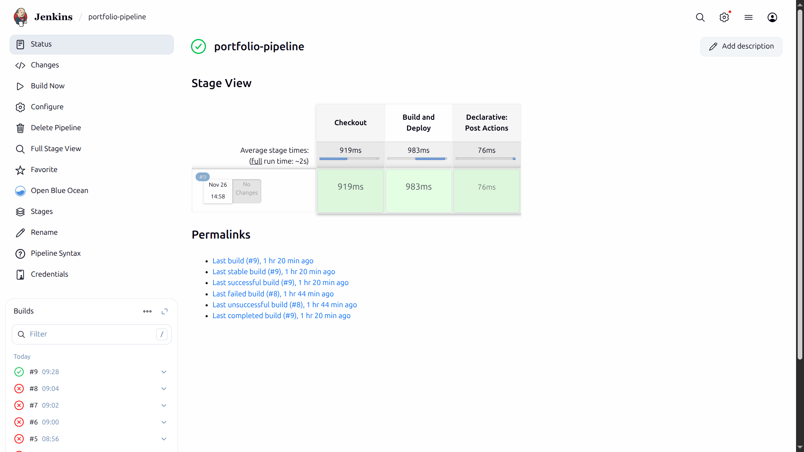
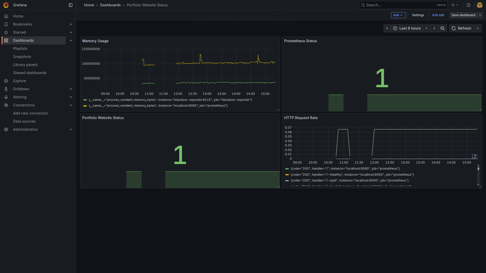
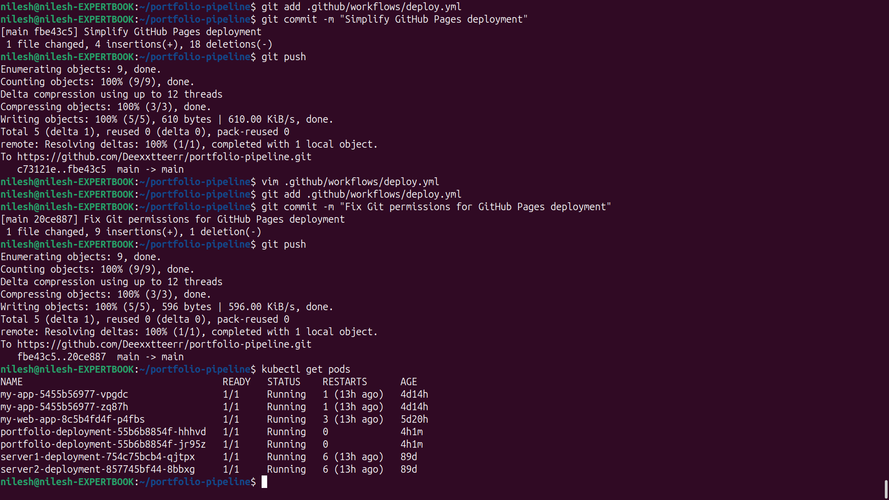
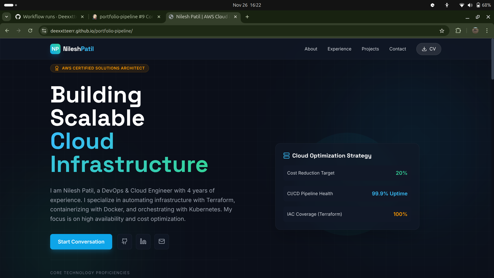
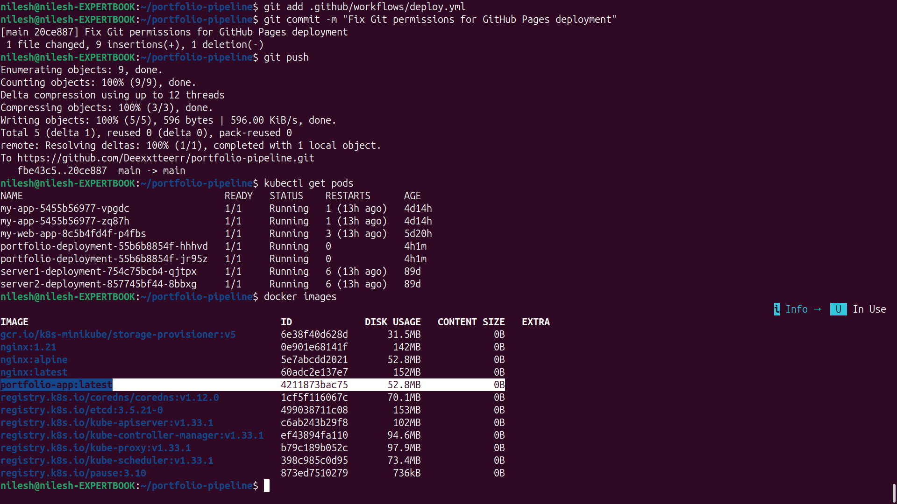
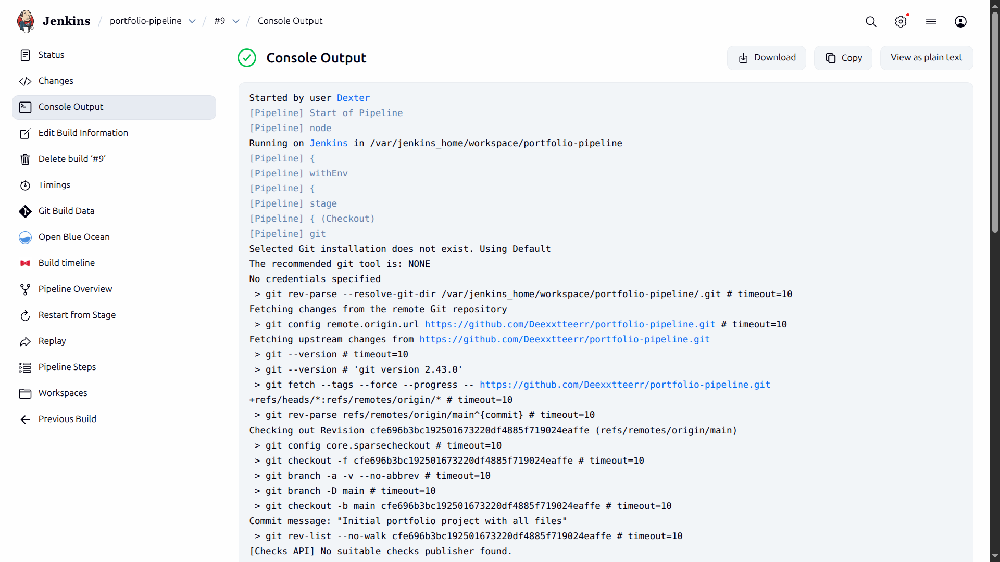

# DevOps Portfolio CI/CD Pipeline

## 🚀 Project Overview

This project demonstrates a complete CI/CD pipeline for a personal portfolio website. It showcases the automation of building, testing, and deploying a containerized web application using modern DevOps tools and practices. The pipeline is designed to handle both local development and production deployment to the cloud, highlighting a dual-pipeline strategy.

The primary goal is to create a robust, automated workflow that takes code from a Git repository, builds a Docker image, pushes it to a registry, and deploys it to a Kubernetes cluster. The entire infrastructure is monitored using Prometheus and Grafana.

## 🏗️ Architecture Diagram

*(Placeholder for your architecture diagram. You can create one using a tool like diagrams.net (formerly draw.io) and embed it here. The diagram should illustrate the flow from code commit to deployment and monitoring.)*

A typical architecture for this project would look like this:
1.  **Developer** pushes code to **GitHub**.
2.  **GitHub Actions** or **Jenkins** triggers a new build.
3.  **Jenkins/GitHub Actions** builds a **Docker image**.
4.  The image is pushed to **Docker Hub**.
5.  **Jenkins/GitHub Actions** deploys the new image to a **Kubernetes cluster**.
6.  **Prometheus** scrapes metrics from the Kubernetes cluster and services.
7.  **Grafana** visualizes the metrics from Prometheus.
8.  Users access the portfolio website running in the **Kubernetes cluster**.

## 🛠️ Technologies Used

*   **CI/CD:** Jenkins, GitHub Actions
*   **Containerization:** Docker
*   **Orchestration:** Kubernetes (Minikube for local setup)
*   **Monitoring:** Prometheus, Grafana
*   **Version Control:** Git, GitHub
*   **Web Server:** Nginx (as seen in the Dockerfile)
*   **Cloud:** GitHub Pages for the live portfolio

## ✨ Features Implemented

*   **Automated CI/CD Pipeline:** Fully automated pipeline from code commit to deployment.
*   **Containerized Application:** The portfolio website is containerized using Docker for portability and scalability.
*   **Kubernetes Deployment:** The application is deployed and managed by Kubernetes.
*   **Infrastructure as Code:** Kubernetes manifests (`k8s/`) are used to define the desired state of the application.
*   **Monitoring and Alerting:** The environment is monitored with Prometheus and Grafana, providing insights into the application's performance and health.
*   **Dual Pipeline Strategy:**
    *   **Local Development:** A local pipeline using Jenkins, Docker, and Minikube for development and testing.
    *   **Cloud Deployment:** A cloud-based pipeline using GitHub Actions to deploy the portfolio to GitHub Pages.

## 📊 Live Dashboards & Artifacts

### Jenkins Dashboard


### Grafana Dashboard


### Kubernetes Pods


### Live Portfolio


### Docker Images


### Jenkins Pipeline Logs


## 🔧 Setup Instructions

1.  **Clone the repository:**
    ```bash
    git clone https://github.com/Deexxtteerr/portfolio-pipeline.git
    cd portfolio-pipeline
    ```

2.  **Local Development (Jenkins, Minikube):**
    *   Ensure you have Jenkins, Docker, and Minikube installed.
    *   Start Minikube: `minikube start`
    *   Set up a new pipeline in Jenkins using the `Jenkinsfile` from this repository.
    *   The `k8s/` directory contains the Kubernetes deployment and service manifests.
    *   The `monitoring/` directory contains configurations for Prometheus and Grafana.

3.  **Cloud Deployment (GitHub Actions):**
    *   The deployment to GitHub Pages is handled by the workflow defined in `.github/workflows/deploy.yml`.
    *   This workflow is triggered on a push to the `main` branch.

## 💡 Key Learnings

*   **Container Orchestration with Kubernetes:** Gained hands-on experience in deploying, managing, and scaling applications with Kubernetes. Understood the concepts of Pods, Deployments, and Services.
*   **CI/CD Automation with Jenkins:** Learned to create and manage complex CI/CD pipelines, including scripting with `Jenkinsfile` and integrating with Docker and Kubernetes.
*   **Infrastructure Monitoring:** Implemented a monitoring stack with Prometheus and Grafana to collect metrics and visualize the health of the Kubernetes cluster and applications.
*   **Docker Networking Concepts:** Gained a deeper understanding of how Docker networking works, especially in the context of connecting containers and exposing services.
*   **GitHub Actions vs. Jenkins:** Explored the differences between two major CI/CD tools, understanding the trade-offs between a self-hosted solution (Jenkins) and a managed service (GitHub Actions).

## 🚨 Challenges & Solutions

*   **Problem: Jenkins Container Isolation:** Faced issues with Jenkins jobs running in isolated containers and accessing necessary tools (like Docker, kubectl).
    *   **Solution:** Solved by mounting the Docker socket and other required binaries into the Jenkins agent container, allowing it to interact with the host's Docker daemon and other tools.

*   **Problem: GitHub Pages Deployment Errors:** Encountered errors during the deployment to GitHub Pages.
    *   **Solution:** Debugged and corrected the GitHub Actions workflow (`deploy.yml`), ensuring the correct build steps and deployment tokens were used.

*   **Problem: Docker Image Access in Kubernetes:** The Kubernetes cluster had trouble pulling the Docker image from the local registry.
    *   **Solution:** Configured the `imagePullPolicy` in the Kubernetes Deployment manifest to `IfNotPresent` or `Never` for local images and ensured the image was available in Minikube's Docker daemon.

*   **Problem: Monitoring Setup:** Difficulty in getting Prometheus to scrape metrics from the application services.
    *   **Solution:** Resolved container networking issues and correctly configured Prometheus scrape targets and service annotations to enable metric collection.

## 📈 Results & Metrics

*   **Automation:** Achieved a fully automated pipeline, reducing manual deployment efforts to zero.
*   **Live Portfolio:** A publicly accessible portfolio website, demonstrating the final output of the pipeline.
*   **Professional URL:** A clean, professional URL for sharing with employers and mentors.

## 🔗 Live Demo Links

*   **Live Portfolio:** [https://deexxtteerr.github.io/portfolio-pipeline](https://deexxtteerr.github.io/portfolio-pipeline)
*   **GitHub Repository:** [https://github.com/Deexxtteerr/portfolio-pipeline](https://github.com/Deexxtteerr/portfolio-pipeline)

## 📞 Contact Information

*   **GitHub:** [Deexxtteerr](https://github.com/Deexxtteerr)
*   **LinkedIn:** *(Your LinkedIn Profile URL)*
*   **Email:** *(Your Email Address)*
